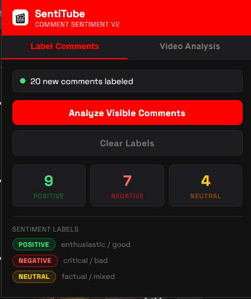

# SentiTube v3 – Developer Guide

---

## Files

```
sentitube-extension/
├── manifest.json   – Chrome MV3 config, permissions, host_permissions
├── content.js      – Injected into YouTube; collects & labels DOM comments
├── popup.html      – Extension popup UI (two tabs)
├── popup.js        – Popup logic; video-level analysis API call
└── README.md       – This file
```

---

## Quickstart: two things to configure

### 1 — Set your API base URL (do this in BOTH files)

**`content.js` line 21:**
```js
const API_BASE = 'https://your-api-domain.com';
```

**`popup.js` line 13:**
```js
const API_BASE = 'https://your-api-domain.com';
```

### 2 — Add your domain to the extension permissions

**`manifest.json` → `host_permissions`:**
```json
"host_permissions": [
  "https://www.youtube.com/*",
  "https://your-api-domain.com/*"
]
```

---

## Disabling simulate mode

Both files have a `SIMULATE` flag. While `true`, all API calls are replaced
with random fake responses so you can see the UI working locally.
Flip both to `false` once your server is running:

**`content.js` line 22:**
```js
const SIMULATE = false;
```

**`popup.js` line 14:**
```js
const SIMULATE = false;
```

---

## API Contract 1 — Batch comment sentiment (Tab 1: "Label Comments")

**Called by:** `content.js`
**When:** User clicks "Analyze Visible Comments" in Tab 1.

### How the batch is built

1. `content.js` queries every `yt-formatted-string#content-text` element on the page.
2. It filters out any element whose parent already contains a `.sentitube-badge`
   (so re-clicking only sends *new* comments — never re-sends already-labeled ones).
3. A loading badge (`…`) is inserted next to each unlabeled comment immediately,
   before the API call even fires.
4. The unlabeled comment texts are collected into a single array and sent in **one
   HTTP request**.
5. On response, each result is mapped back to its DOM element via `comment_id`
   and the loading badge is replaced with the final colored badge.

---

### Endpoint

```
POST https://your-api-domain.com/predict_batch
Content-Type: application/json
```

### Request body

```json
{
  "comments": [
    {
      "comment_id":   "st-1719000000-0",
      "comment_text": "This video is absolutely amazing!"
    },
    {
      "comment_id":   "st-1719000000-1",
      "comment_text": "The audio quality is really bad."
    },
    {
      "comment_id":   "st-1719000000-2",
      "comment_text": "Uploaded on Tuesday, about 12 minutes long."
    }
  ]
}
```

| Field                       | Type   | Description                                                        |
|-----------------------------|--------|--------------------------------------------------------------------|
| `comments`                  | array  | All unlabeled comments in the current viewport                     |
| `comments[].comment_id`     | string | Generated by the extension (`st-{timestamp}-{index}`). Your server must echo this back in the response so the extension can match each result to its DOM element. |
| `comments[].comment_text`   | string | Raw text content of the YouTube comment                            |

---

### Response body

```json
{
  "results": [
    {
      "comment_id":  "st-1719000000-0",
      "sentiment":   "positive",
      "confidence":  0.94
    },
    {
      "comment_id":  "st-1719000000-1",
      "sentiment":   "negative",
      "confidence":  0.88
    },
    {
      "comment_id":  "st-1719000000-2",
      "sentiment":   "neutral",
      "confidence":  0.76
    }
  ]
}
```

| Field                  | Type   | Required | Description                                             |
|------------------------|--------|----------|---------------------------------------------------------|
| `results`              | array  | yes      | One entry per comment, same order or any order (matched by `comment_id`) |
| `results[].comment_id` | string | yes      | Must match the `comment_id` sent in the request         |
| `results[].sentiment`  | string | yes      | One of `"positive"`, `"negative"`, `"neutral"`          |
| `results[].confidence` | float  | no       | 0.0 – 1.0. Shown in badge tooltip. Omit if not available. |

**Important:** If your server cannot classify a comment, omit that `comment_id`
from `results`. The extension will silently remove its loading badge without
crashing.

---

### How `comment_id` maps the result to the DOM element

```
Request:                        Response:
comment_id: "st-abc-0"  ──────▶ comment_id: "st-abc-0"
                                 sentiment:  "positive"
                                      │
                                      ▼
                         document.querySelector(
                           '[data-st-id="st-abc-0"]'   ← loading badge
                         )
                         .className = "sentitube-badge positive"
```

The extension uses a `data-st-id` attribute on each loading badge to find and
update it once the API responds. The `comment_id` is the glue between the HTTP
response and the DOM.

---

### What your server needs to implement for this endpoint

- Accept an array of `{ comment_id, comment_text }` objects.
- Run your sentiment model on each `comment_text`.
- Return results with the same `comment_id` values echoed back.
- Order of results does not need to match order of input — matching is by ID.
- Recommended: process comments in parallel on the server for speed.

---

## API Contract 2 — Video-level analysis (Tab 2: "Video Analysis")

**Called by:** `popup.js`
**When:** User clicks "Fetch Video Analysis" in Tab 2.

---

### Endpoint

```
POST https://your-api-domain.com/analyze_video
Content-Type: application/json
```

### Request body

```json
{
  "video_id":    "dQw4w9WgXcQ",
  "max_comments": 25
}
```

| Field          | Type   | Required | Description                                                  |
|----------------|--------|----------|--------------------------------------------------------------|
| `video_id`     | string | yes      | YouTube video ID extracted from the URL `?v=` parameter      |
| `max_comments` | int    | no       | How many top comments to return in `top_comments`. Default: 25 |

---

### Response body

```json
{
  "video_id": "dQw4w9WgXcQ",

  "summary": {
    "total_comments_fetched": 320,
    "positive_pct":  62.5,
    "negative_pct":  18.2,
    "neutral_pct":   19.3,
    "avg_confidence": 0.87
  },

  "engagement": {
    "total_likes":              14820,
    "avg_likes_per_comment":    46.3,
    "top_comment_likes":        3200,
    "total_replies":            412
  },

  "trend": [
    "positive", "neutral", "positive", "negative", "positive"
  ],

  "wordcloud_image": "data:image/png;base64,iVBORw0KGgoAAAANS...",

  "top_comments": [
    {
      "comment_id":  "Ugz_abc123XYZ",
      "author":      "@channelname",
      "text":        "Best video ever!",
      "likes":       320,
      "reply_count": 14,
      "sentiment":   "positive",
      "confidence":  0.94
    }
  ]
}
```

---

### Field reference

#### `summary` object

| Field                    | Type  | Description                                              |
|--------------------------|-------|----------------------------------------------------------|
| `total_comments_fetched` | int   | Total comments your server fetched from YouTube Data API |
| `positive_pct`           | float | % of fetched comments classified as positive (0–100)     |
| `negative_pct`           | float | % negative                                               |
| `neutral_pct`            | float | % neutral. The three should sum to 100.                  |
| `avg_confidence`         | float | Mean model confidence across all classified comments     |

#### `engagement` object

| Field                    | Type  | Description                                              |
|--------------------------|-------|----------------------------------------------------------|
| `total_likes`            | int   | Sum of likes across all fetched comments                 |
| `avg_likes_per_comment`  | float | `total_likes / total_comments_fetched`                   |
| `top_comment_likes`      | int   | Highest like count on any single comment                 |
| `total_replies`          | int   | Sum of reply counts across all fetched comments          |

#### `trend` array

| Field   | Type            | Description                                                    |
|---------|-----------------|----------------------------------------------------------------|
| `trend` | array of string | Sentiment label for each comment in `top_comments`, in order. Used to draw the mini trend bar chart in the popup. Length should equal `top_comments.length`. Values: `"positive"`, `"negative"`, `"neutral"`. |

#### `wordcloud_image` field

| Value                              | How the extension handles it                    |
|------------------------------------|-------------------------------------------------|
| `"data:image/png;base64,ABC..."`   | Sets as `` directly — no extra request |
| `"https://your-cdn.com/wc/v.png"`  | Sets as `` — browser fetches the URL   |
| `null`                             | Shows a placeholder message                     |

Generate the word cloud server-side (e.g. Python `wordcloud` library) from
the comment texts, render to PNG, base64-encode it, and embed in the response.

#### `top_comments` array

| Field         | Type   | Required | Description                                        |
|---------------|--------|----------|----------------------------------------------------|
| `comment_id`  | string | yes      | Real YouTube comment ID (from YouTube Data API)    |
| `author`      | string | yes      | YouTube channel handle, e.g. `"@username"`         |
| `text`        | string | yes      | Full comment body                                  |
| `likes`       | int    | yes      | Like count on the comment                          |
| `reply_count` | int    | no       | Number of replies. Omit if unavailable.            |
| `sentiment`   | string | yes      | `"positive"`, `"negative"`, or `"neutral"`         |
| `confidence`  | float  | no       | 0.0 – 1.0, shown in the comment list               |

---

### What your server needs to implement for this endpoint

1. Call **YouTube Data API v3** → `commentThreads.list` with `videoId`, ordered
   by `relevance`, to fetch comments. You need a YouTube Data API key for this.
2. Run your sentiment model on each comment text.
3. Compute `summary` percentage fields.
4. Compute `engagement` fields from the YouTube API comment metadata.
5. Build the `trend` array from the top `max_comments` results in order.
6. Generate a word cloud PNG from all comment texts, base64-encode it.
7. Sort `top_comments` by `likes` descending, return top `max_comments`.

---

## Common additions you might want later

### Auth header
If your API requires a token, add this to both fetch calls in `content.js`
and `popup.js`:
```js
headers: {
  'Content-Type': 'application/json',
  'Authorization': 'Bearer YOUR_API_TOKEN'
}
```

### Sending real tally back from content.js
The content.js `labelComments()` function already returns
`{ count, positive, negative, neutral }` from the API response.
Make sure your `/predict_batch` response includes the correct sentiment
per comment and the popup will show real — not randomized — stat counts.

### Handling YouTube comment pagination
YouTube renders comments lazily as the user scrolls. Each time the user
scrolls down and clicks "Analyze Visible Comments", only newly rendered
(unlabeled) comments are sent. There is no need to paginate from the
extension side — the incremental batch logic handles it automatically.

---

## Screenshots

### Tab 1 — Comment Labeling


### Tab 2 — Video Analysis


---

## Installation (developer mode)

1. Open `chrome://extensions`
2. Toggle **Developer mode** on (top right)
3. Click **Load unpacked** → select this folder
4. Open any YouTube video, scroll to load comments
5. Click the SentiTube icon in the toolbar